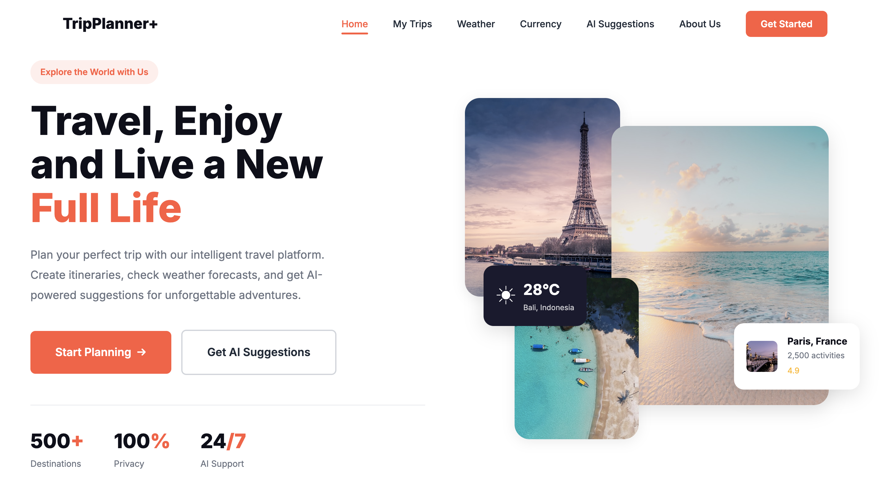
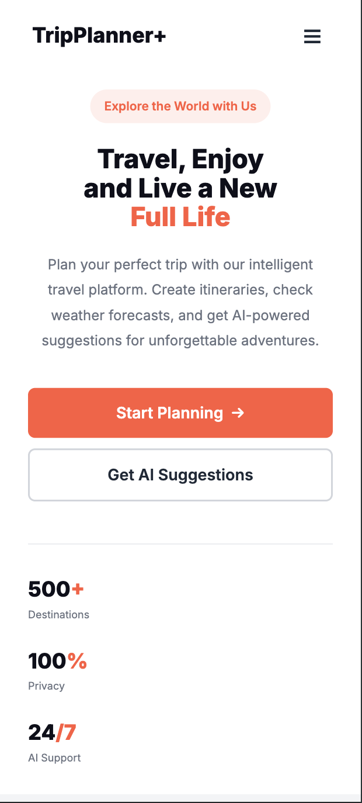
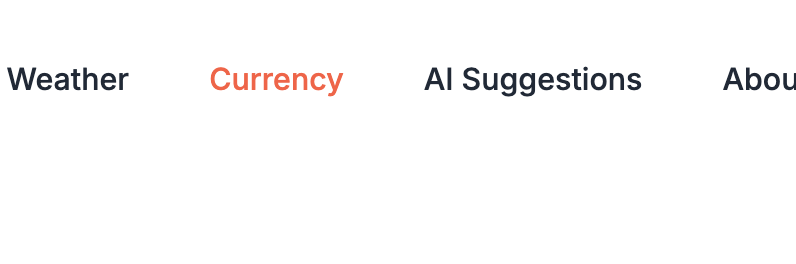
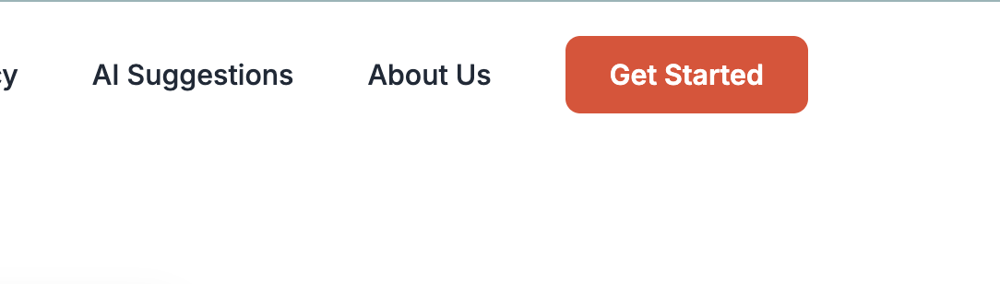
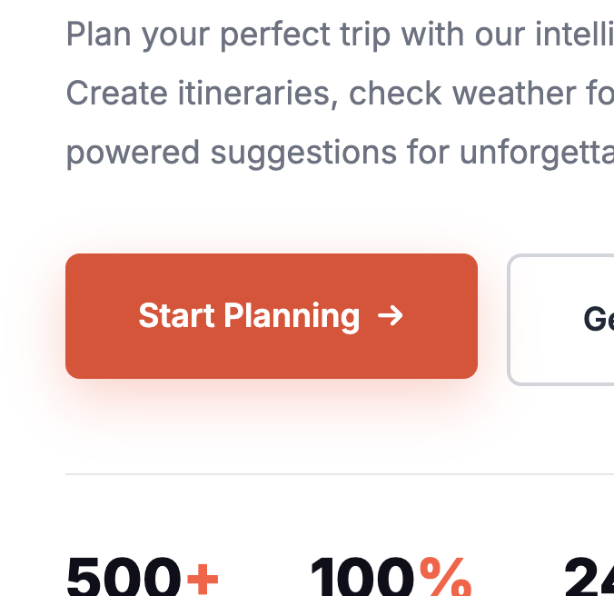

# Examen 1 - Parte 2

> [!IMPORTANT]
> Es imprescindible aprobar la parte 1 para que esta parte 2 sea evaluada.
>
> Se permite IA como apoyo, pero el alumno debe comprender y poder modificar su código.
> Entregas con patrones de copia o sin autoría demostrable podrán ser invalidadas.

Haz una página web usando **todas** las buenas prácticas que conozcas que muestre lo siguiente **DEJANDO EL FONDO EN BLANCO**:

Y en versión móvil se debe mostrar así:

---

## 🎨 Guía de estilos

### General
- Fuente: [Inter](https://fonts.google.com/specimen/Inter)
- Colores necesarios:

| Nombre sugerido | Código de color |
|-----------------|-----------------|
| primary-color   | `#FF5A3C`       |
| primary-light-color | `rgba(255, 90, 60, 0.1)` |
| dark-color      | `#0F0F1A`       |
| dark2-color     | `#1A1A2E`       |
| text-color      | `#1F2937`       |
| white-color     | `#FFFFFF`       |
| light-color     | `#6B7280`       |
| light-border-color | `#D1D5DB`    |
| accent-color    | `#FFB800`       |

---

### Hovers

Todos los hovers estarán animados y puedes ver los efectos en las siguientes imágenes:

- Links navbar:

- Botón navbar:

- Call to action button *Start planning →*:

- Call to accion button *Get AI Suggestions*:

---

### Imágenes necesarias

Las imágenes las encontrarás en los siguientes enlaces:

- [Playa1](./assets/photo-beach1.png)
- [Torre Eiffel](./assets/photo-eiffel-tower.png)
- [Playa2](./assets/photo-beach2.png)
- [Puente](./assets/photo-bridge.png)
